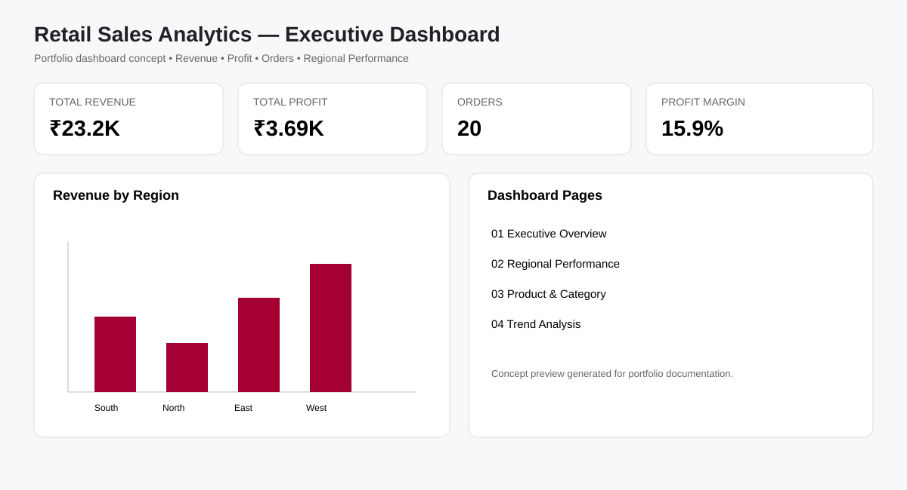

# Retail Sales Data Analysis & Dashboard


## Business Objective
Analyze retail transaction data to understand revenue, profit, regional performance, category/product contribution and monthly sales trends.

## Tools & Skills
**Excel · MySQL · Python · Pandas · Matplotlib · Power BI · DAX · Data Cleaning · EDA · KPI Reporting**

## Dashboard Preview


> The image is a portfolio dashboard concept. The repository contains the Power BI build specification and DAX measures used to reproduce the dashboard.

## Project Workflow
`Data Validation → Excel Exploration → SQL Analysis → Python EDA → Power BI Modeling → Dashboard`

## Key Business Questions
- Which regions generate the most revenue and profit?
- Which categories/products contribute most to sales?
- How does revenue change over time?
- What is the average order value and profit margin?
- Which areas deserve deeper commercial investigation?

## Power BI Dashboard
- **Executive Overview:** Revenue, Profit, Orders, AOV, Profit Margin
- **Regional Performance:** Revenue, profit, order count and margin by region
- **Product & Category:** Top products, category contribution and profitability
- **Trend Analysis:** Monthly revenue/profit and order trends

See [`power-bi/DASHBOARD_BUILD.md`](power-bi/DASHBOARD_BUILD.md) and [`power-bi/DAX_measures.txt`](power-bi/DAX_measures.txt).

## Dataset
A compact synthetic sample is included for quick GitHub review. Run [`data/generate_data.py`](data/generate_data.py) to generate the full **10,000-row** synthetic portfolio dataset used by the analysis workflow.

## Repository Structure
```text
retail-sales-data-analysis/
├── data/
│   ├── retail_sales.csv
│   ├── generate_data.py
│   ├── DATASET_NOTE.md
│   └── DATA_DICTIONARY.md
├── sql/analysis_queries.sql
├── python/retail_analysis.py
├── power-bi/
│   ├── DAX_measures.txt
│   └── DASHBOARD_BUILD.md
├── docs/dashboard-preview.svg
└── PORTFOLIO_OVERVIEW.md
```

## Run Python
```bash
pip install -r requirements.txt
python python/retail_analysis.py
```

## Portfolio Disclaimer
All data in this repository is synthetic and intended for portfolio demonstration. It must not be represented as confidential or client-owned data.
